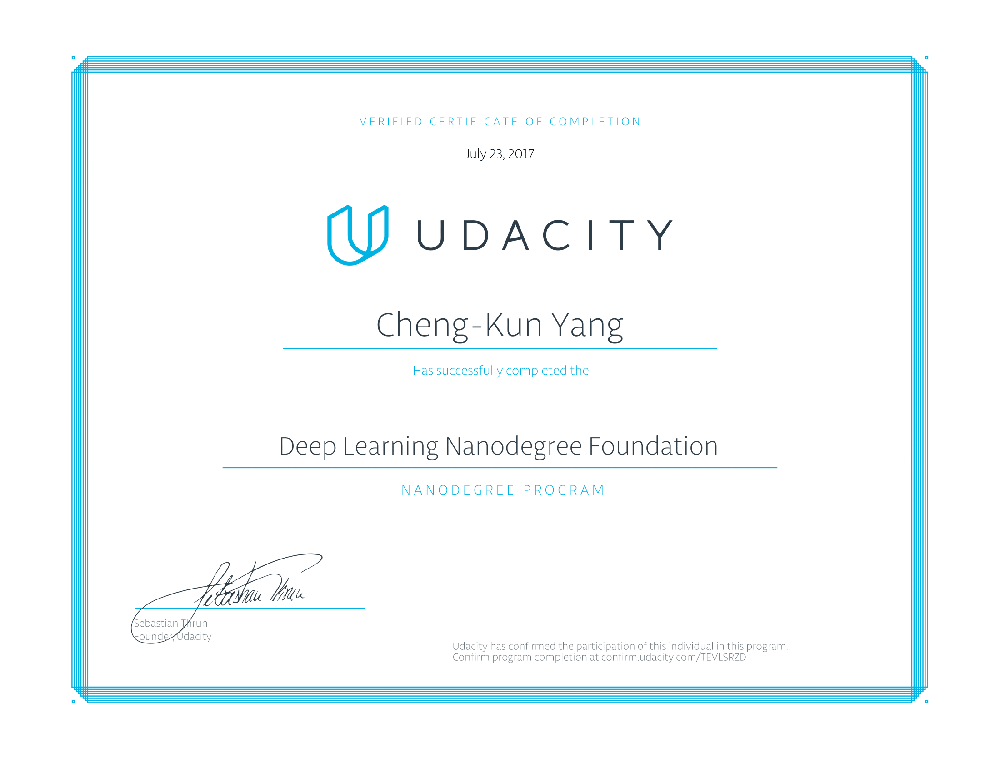

## udacity_deep_learning_nano_degree

I learn deep learning theory and coding from this nano degree, including Deep neural network, Convolutional neural network, Recurrent neural network and Generative adversiral network.

Here are the projects list

- Your first neural network
- Image Classification
- Generate TV Scripts
- Translation Project
- Generate Faces

